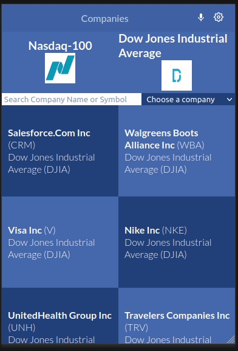

# Company Profile


> This web application retrieves real live data from [the Financial modeling prep API](https://site.financialmodelingprep.com/developer/docs). It provides financial information about companies listed on Nasdaq 100 and Dow Jones Market indexes. All these companies are listed on the Home page.
> Users can filter these companies by searching for a specific company or by choosing one from the dropdown.
> Every company has a specific route that displays all the information about the chosen company.



## Live Demo

You can see [the app live here](https://space-travelers-hub-pair-programming.netlify.app/)

## Setup

### Clone this repository

```bash
$ git clone git@github.com:Sahar-AbdelSamad/company-profile.git
$ cd company-profile
```

### Run project

```bash
$ npm install
$ npm run start
```
### Run tests

To run the test just use the following command!

```bash
$ npm run test
```

## Built With

- React
- Redux
- JavaScript
- CSS

## Authors

👤 **Sahar Abdel Samad**

- GitHub: [@sahar-abdelsamad](https://github.com/Sahar-AbdelSamad)
- Twitter: [@abdelsamadsahar](https://twitter.com/AbdelSamadSahar)
- LinkedIn: [sahar-abdel-samad](https://www.linkedin.com/in/sahar-abdel-samad/)

## 🤝 Contributing

Contributions, issues, and feature requests are welcome!

Feel free to check the [issues page](https://github.com/Sahar-AbdelSamad/company-profile/issues).

## Acknowledgments

- Original design idea by [Nelson Sakwa on Behance](https://www.behance.net/sakwadesignstudio)
## Show your support

Give a ⭐️ if you like this project!